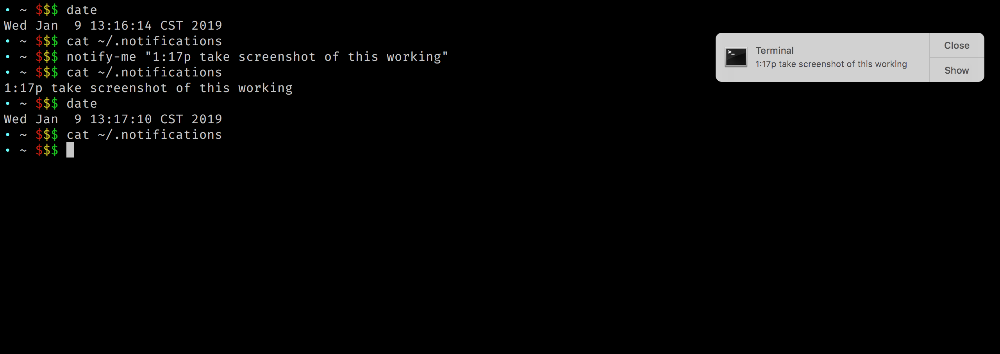

# notifications

Write notifications to yourself. Get mac notifications.

## Usage

Assuming the `notifications` script is set up to run on a regular cron, just add lines to `~/.notifications` like so:

```
12:00 eat lunch
3:30p play ping pong
```

Once notifications are sent, they're removed from `~/.notifications` automatically.

### alias

Add an `alias` to your `~/.bash_profile` to make this even easier:

```
alias notify-me="echo $1 >> ~/.notifications"
```

So you can then do:

```
$ notify-me "8:30p go to bed sleepy head"
```

## install / setup

Install [`terminal-notifier`](https://github.com/julienXX/terminal-notifier).

```
$ brew install terminal-notifier
```

Create a symlink to the `notifications` script:

```
# from ~/src/notifications
$ ln -s "$(pwd)/notifications" /usr/local/bin/notifications
```

Add to cron:

```
* * * * * /usr/local/bin/notifications
```

**Note** to edit the crontab on a mac, do `crontab -e`.

## demo


